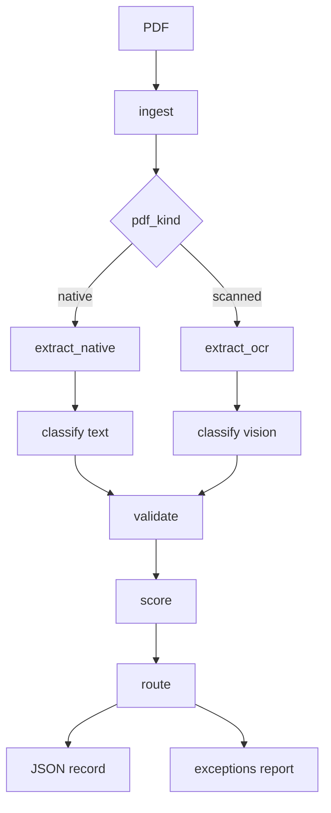

# Corporate Events Agent

Pipeline que transforma avisos de eventos corporativos (PDFs no padrao B3/CVM)
em registros estruturados, validados e auditaveis para asset servicing.

Erros de extracao aqui sao erros financeiros/regulatorios: classificar errado
o tipo de provento (ex. dividendo vs JCP) muda tratamento tributario. Por isso
a LLM **extrai e classifica**; regras de coerencia sao **codigo deterministico**
testavel; baixa confianca vai para **humano**, sem retry silencioso.

A solucao e um DAG linear em Python 3.11 + Pydantic v2 + SDK OpenAI
(structured outputs), sem frameworks de agentes. PDFs nativos seguem texto
(`pdfplumber`); escaneados usam visao (`VISION_MODEL`) so quando a densidade
de caracteres fica abaixo do limiar. Cada campo carrega evidencia literal
(snippet, pagina, metodo) para o operador auditar sem reabrir o PDF. A saida
e um JSON por documento em `output/records/` e um
`output/exceptions_report.md` consolidado.

## Fluxo do pipeline



Detalhe: [docs/architecture/data-flow.md](docs/architecture/data-flow.md).

## Como rodar

### Setup

```bash
python -m venv .venv
# Windows:
.\.venv\Scripts\activate
# Linux/macOS:
# source .venv/bin/activate

pip install -e .
copy .env.example .env   # ou cp .env.example .env
```

Preencha `OPENAI_API_KEY` no `.env` (o arquivo **nao** entra no git).

Modelos (default `gpt-5.4-mini`):

- `EXTRACTION_MODEL`  - PDF nativo
- `CLASSIFICATION_MODEL`  - classificacao com texto
- `VISION_MODEL`  - OCR/visao (scanned)

### CLI (lote)

```bash
python main.py --input documents/ --output output/
```

Gera `output/records/<doc_id>.json` e `output/exceptions_report.md`, com
progresso no console por documento.

### Testes

```bash
# Suite padrao (sem chamadas de LLM)
pytest

# Integracao com OpenAI (marcador llm)
pytest -m llm
```

## Resultados do lote

Execucao de referencia (`python main.py` sobre os 8 PDFs):

| Doc | tipo_evento | rota | overall | motivo |
|------|-------------|------|---------|--------|
| 01_energetica_vale_tiete_dividendo | dividendo | auto_approve | 0.846 | warnings: gross_net, isin_checksum (golden ok) |
| 02_banco_meridional_jcp | jcp | auto_approve | 0.929 | warning isin_checksum (golden ok) |
| 03_siderurgica_paranaense_proventos | jcp | human_review | 0.893 | tipo_evento low (divergencia titulo/conteudo) |
| 04_rede_varejo_jcp_sem_data | jcp | auto_approve | 0.857 | warnings: pagamento ausente, isin_checksum |
| 05_aurora_saneamento_dividendo_datas | dividendo | human_review | 0.704 | fail date_coherence (pagamento antes de com/ex) |
| 06_petroquimica_litoral_grupamento | grupamento | auto_approve | 0.904 | warning isin_checksum (golden ok) |
| 07_telecom_norte_jcp_SCAN | jcp | human_review | 0.743 | OCR overall < 0.85 |
| 08_construtora_horizonte_bonificacao | bonificacao | human_review | 0.729 | fail golden_records (emissor inexistente) |

Relatorio completo: `output/exceptions_report.md`.

## Decisoes de arquitetura

| ADR | Resumo |
|-----|--------|
| [ADR-001](docs/decisions/ADR-001-sem-framework.md) | Pipeline em funcoes puras; sem LangGraph/LangChain |
| [ADR-002](docs/decisions/ADR-002-date-coherence.md) | Coerencia de datas; armadilha do doc 05 |
| [ADR-003](docs/decisions/ADR-003-structured-outputs.md) | Structured outputs strict + schema intermediario |
| [ADR-004](docs/decisions/ADR-004-golden-over-isin-checksum.md) | golden_records prevalece sobre checksum ISIN ficticio |
| [ADR-005](docs/decisions/ADR-005-type-consistency-classifier.md) | type_consistency usa so `divergencia_titulo_conteudo` |
| [ADR-006](docs/decisions/ADR-006-aliquota-condicional.md) | aliquota_ir so se aplica ao evento (nao nota generica) |
| [ADR-007](docs/decisions/ADR-007-ocr-confidence-ceiling.md) | Base 0.70 OCR + route se overall < 0.85 |
| [ADR-008](docs/decisions/ADR-008-model-as-config.md) | Tres knobs de modelo via settings/.env |

## O que eu decidi NAO fazer e por que

- **Sem framework de agentes**  - o fluxo e um DAG com um `if` (nativo/scanned);
  LangGraph/LangChain so aumentariam abstracao e superficie de debug na
  sessao ao vivo ([ADR-001](docs/decisions/ADR-001-sem-framework.md)).
- **Sem RAG**  - o lote tem 8 avisos autocontidos; retrieval sobre corpus
  externo nao resolve divergencia titulo/conteudo nem datas no proprio PDF.
- **Sem retry automatico em baixa confianca**  - em contexto regulatorio,
  "retry ate passar" mascara incerteza; o correto e human_review com
  justificativa (AGENTS.md).
- **Sem OCR local (Tesseract etc.)**  - scanned usa a mesma LLM de visao do
  structured output; evita dependencia e segundo motor de texto
  ([ADR-007](docs/decisions/ADR-007-ocr-confidence-ceiling.md)).
- **Sem classificador treinado**  - interface `EventClassifier` pronta, mas
  nao ha dataset (8 docs); hoje e LLM; em producao com volume um modelo
  supervisionado reduziria custo (trade-off documentado, nao implementado).

## Limitacoes conhecidas

- **Deteccao nativo vs scanned por densidade media** de caracteres por pagina:
  limiar unico pode errar em PDF hibrido (capa escaneada + texto nativo).
- **Confianca heuristica, nao calibrada**  - scores sao regras (metodo +
  validadores), nao probabilidade empirica; limiares (0.8 high, 0.85 OCR)
  sao politicas operacionais, nao metrica AUC.
- ISINs do lote de teste sao ficticios: checksum ISO falha com frequencia;
  a hierarquia golden > checksum mitiga no laboratorio
  ([ADR-004](docs/decisions/ADR-004-golden-over-isin-checksum.md)).

## Estrutura

Ver `AGENTS.md` / `CLAUDE.md` para convencoes e gabarito das armadilhas.
Contrato JSON comentado: [docs/schemas/output-json-example.md](docs/schemas/output-json-example.md).
