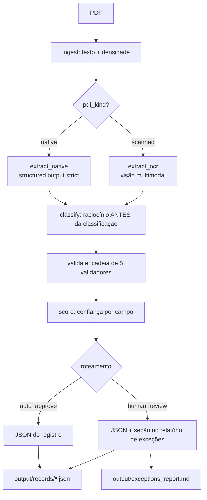

# Corporate Events Agent

Pipeline que transforma avisos de eventos corporativos (PDFs no padrão B3/CVM) em registros estruturados, validados e auditáveis para Asset Servicing.

## O problema

Avisos aos acionistas comunicam eventos corporativos — dividendos, JCP, bonificações, grupamentos — em formato de documento livre. Erros de extração aqui são erros financeiros e regulatórios: classificar um JCP como dividendo muda o tratamento tributário (JCP tem IRRF retido na fonte; dividendo comum, não). Um pipeline confiável precisa não apenas extrair, mas **provar de onde extraiu, validar coerência e admitir incerteza**.

A solução processa um lote de PDFs e produz, por documento, um JSON com: campos extraídos, evidência literal de cada campo (trecho + página + método), classificação com raciocínio registrado, resultado de 5 validações determinísticas, confiança por campo com justificativa e decisão de roteamento (aprovação automática ou revisão humana, com motivos). Um relatório de exceções consolida o lote para o operador.

## A tese da arquitetura

**A LLM extrai e classifica; código determinístico valida; baixa confiança vai para humano com justificativa — nunca retry silencioso.** Em contexto regulatório, "tentar de novo até passar" mascara incerteza; rotear para revisão a expõe.

## Fluxo do pipeline



### As etapas, uma a uma

**1. Ingestão** (`src/extraction/ingest.py`) — extrai texto por página via pdfplumber e mede densidade de caracteres. Abaixo do limiar (configurável, `settings.text_density_threshold`), o PDF é `scanned` e as páginas viram imagens base64. **Por quê:** no lote, nativos têm 1.067–1.527 chars/página e o escaneado tem 0 — a densidade separa com margem de ~20x, e imagens só são geradas quando necessárias (custo).

**2. Extração nativa** (`src/extraction/extract.py`) — LLM com structured outputs (`json_schema`, `strict: true`): a API restringe a geração à gramática do schema, garantindo contrato, não só JSON válido. Cada campo carrega `FieldEvidence` (snippet literal, página, método). Campos ausentes ficam `null` — nunca inventados; ausência declarada no documento (ex.: pagamento "a definir") é sinalizada em flag própria. **Por quê:** o operador audita sem reabrir o PDF, e uma classe inteira de erros de formato deixa de existir.

**3. Extração multimodal** (`src/extraction/ocr.py`) — apenas para `scanned`: envia as imagens ao modelo de visão com o **mesmo schema** da extração nativa, marcando `method=ocr`. **Por quê:** o doc 07 tem densidade zero (imagem pura) — sem essa rota ele é invisível ao pipeline. PDFs nativos nunca passam por aqui (custo).

**4. Classificação** (`src/classification/`) — o schema de saída força a ordem: evidências → raciocínio → tipo declarado no título → **tipo_evento** → divergência. Como a LLM é autoregressiva, ela escreve o raciocínio antes de classificar e condiciona a decisão nele. O prompt lista sinais determinísticos de cada tipo (JCP: TJLP, IRRF 15/17,5%, imputação ao dividendo obrigatório — art. 9º Lei 9.249/95; bonificação: capitalização de reservas; etc.) e manda classificar pelo **conteúdo**, nunca pelo título. **Por quê:** o doc 03 tem título "Dividendos" e conteúdo de JCP — classificar pelo título erraria o tratamento tributário; a divergência é detectada e registrada.

**5. Validação** (`src/validation/`) — cadeia de 5 validadores determinísticos (Chain of Responsibility), cada um retornando `pass | fail | warning | not_applicable`:
- `golden_records`: match de emissor/ISIN/ticker/CNPJ contra a base de referência (Repository pattern; match normalizado — caixa, espaços, acentos).
- `date_coherence`: exige `aprovação ≤ data_com < data_ex ≤ pagamento`; ausência **declarada** no documento é warning, não fail.
- `gross_net_consistency`: `bruto × (1 − alíquota) ≈ líquido`; não se aplica a grupamento/bonificação.
- `isin_checksum`: dígito verificador ISO 6166, com hierarquia de fontes — ISIN confirmado no golden_records rebaixa checksum inválido a warning (os ISINs do lote são fictícios).
- `type_consistency`: consome a decisão de divergência do classificador (que leu o documento), em vez de recomputá-la por string matching.

**Por quê validação em código e não em LLM:** é testável (pytest, sem tokens), auditável e barato — e foi um validador determinístico que detectou a armadilha não mapeada do doc 05.

**6. Confiança** (`src/confidence/scorer.py`) — score por campo combinando sinais: método de extração (OCR tem teto menor que nativo), validadores que tocam o campo, divergência de classificação. Cada `FieldConfidence` traz justificativa legível listando os sinais. **Por quê:** confiança sem justificativa não é auditável. Premissa declarada: é score heurístico baseado em sinais verificáveis, não probabilidade calibrada.

**7. Roteamento** (`src/pipeline/steps/route.py`) — política explícita, em ordem de precedência:
1. `fail` em golden_records → human_review (emissor não cadastrado é risco regulatório)
2. `fail` em coerência de datas ou bruto/líquido → human_review
3. Campo crítico (tipo_evento, valor, data_com) com confiança `low` → human_review
4. Documento OCR com confiança geral < 0.85 → human_review
5. Caso contrário → auto_approve (warnings vão ao relatório mesmo assim)

**8. Saídas** (`src/output/`) — um JSON por documento (registro + evidências + validações + rota + trilha de auditoria) em `output/records/`, e `output/exceptions_report.md` com tabela do lote e uma seção por documento em revisão/aviso, legível pelo operador.

## Como rodar

```bash
python -m venv .venv
.\.venv\Scripts\activate        # Windows
pip install -e .
copy .env.example .env           # preencher OPENAI_API_KEY (não entra no git)

python main.py --input documents/ --output output/

pytest          # suite determinística, sem LLM
pytest -m llm   # testes de integração com OpenAI
```

Modelos são configuração, nunca código: `EXTRACTION_MODEL`, `CLASSIFICATION_MODEL` e `VISION_MODEL` no `.env` — subir o tier de uma tarefa é editar uma linha.

## Resultados do lote

| Doc | tipo_evento | rota | overall | motivo |
|---|---|---|---|---|
| 01 energetica dividendo | dividendo | auto_approve | 0.846 | warnings gross_net, isin_checksum |
| 02 banco meridional jcp | jcp | auto_approve | 0.929 | warning isin_checksum |
| 03 siderúrgica proventos | **jcp** | **human_review** | 0.893 | título "Dividendos", conteúdo JCP (divergência) |
| 04 rede varejo sem data | jcp | auto_approve | 0.857 | pagamento ausente **declarado** no doc → warning |
| 05 aurora datas | dividendo | **human_review** | 0.704 | **fail date_coherence**: pagamento 10/07 anterior à data-com 15/07 |
| 06 petroquímica grupamento | grupamento | auto_approve | 0.904 | warning isin_checksum |
| 07 telecom SCAN | jcp | **human_review** | 0.743 | OCR, overall < 0.85 |
| 08 construtora bonificação | bonificacao | **human_review** | 0.729 | **fail golden_records**: emissor não cadastrado |

As 5 armadilhas do lote foram detectadas, cada revisão humana por uma razão distinta — divergência de classificação (03), incoerência de datas (05, **detectada pela regra sem mapeamento prévio**: o PDF paga antes da data-com), incerteza de OCR (07) e entidade desconhecida (08). No doc 07, a leitura via visão foi confirmada por dois cross-checks independentes: bruto × (1 − 0,175) = líquido extraído, e ISIN/ticker com match no golden_records. No doc 01, a menção a "alíquota de 10%" refere-se ao IRRF condicional da legislação de 2026 (sobre o que exceder R$ 50 mil/mês por beneficiário) — **não** é atributo do evento e não foi capturada como alíquota flat.

## Decisões de arquitetura (ADRs em `docs/decisions/`)

| ADR | Decisão | Por quê |
|---|---|---|
| 001 | Python puro + Pydantic, sem framework de agentes | O fluxo é um DAG com 2 branches; um `if` resolve. Framework adicionaria dependência e opacidade sem resolver problema existente. Etapas são funções puras `(DocumentState) → DocumentState` — migração para grafo é natural se surgir necessidade real |
| 002 | Structured outputs `strict` + modelo intermediário de LLM | Strict garante contrato (não só JSON válido); o schema da LLM é flat e compatível com strict, e o registro rico é montado pelo código |
| 003 | Hierarquia golden_records > checksum ISIN | ISINs do lote são fictícios e falham ISO 6166; checksum vira detector de erro de extração, não veto sobre dado confirmado na base |
| 004 | type_consistency consome a decisão do classificador | Recomputar divergência por string matching gerou falso positivo por acento; quem lê o documento decide, o validador consome |
| 005 | Alíquota condicional não é atributo do evento | IRRF de 10% sobre excedente mensal depende do beneficiário; capturá-la como flat produziria valor líquido errado |
| 006 | Teto de confiança para OCR | Campo lido de imagem nunca sai `high`; incerteza do método é sinal explícito no score |
| 007 | Regra de coerência de datas | `aprovação ≤ com < ex ≤ pagamento`; detectou a armadilha não mapeada do doc 05 |
| 008 | Modelo como configuração (3 knobs) | Tier mini como padrão; subir de tier é decisão por tarefa, guiada por medição, sem mudança de código |

## O que decidi NÃO fazer e por quê

- **Sem RAG/vector store**: 8 documentos curtos cabem no contexto; complexidade sem ganho.
- **Sem retry automático em baixa confiança**: em contexto regulatório, retry até passar mascara incerteza — a rota é humana, com justificativa.
- **Sem OCR local (Tesseract)**: LLM multimodal lida melhor com o layout tabular dos avisos; trade-off de custo documentado.
- **Sem classificador treinado**: não há dataset (8 amostras). Em produção com volume, um classificador supervisionado sobre termos jurídicos seria mais barato e determinístico — a interface `EventClassifier` isola essa troca.
- **Sem fila real de revisão humana**: fora do escopo; o relatório de exceções é o contrato, e a rota está isolada para plugar uma fila depois.

## Limitações conhecidas

- Detecção nativo/escaneado por densidade **média**: documentos mistos (páginas nativas + escaneadas) exigiriam detecção por página.
- Confiança é heurística fundamentada em sinais verificáveis, não probabilidade calibrada — calibração exigiria um conjunto rotulado.
- Golden records via CSV local (Repository pattern permite trocar por base/API sem tocar nos validadores).

## Estrutura do repositório

```
├── AGENTS.md / CLAUDE.md      # regras do agente de desenvolvimento
├── README.md
├── main.py                    # CLI do lote
├── config/settings.py         # Pydantic Settings (.env)
├── documents/                 # os 8 PDFs do case
├── golden_records/            # base de referência
├── docs/
│   ├── decisions/             # ADRs 001–008
│   ├── architecture/          # diagrama de fluxo de dados
│   └── schemas/               # contrato do JSON de saída + exemplo
├── src/
│   ├── pipeline/              # state, steps, orquestrador
│   ├── extraction/            # ingest, native, ocr
│   ├── classification/        # classificador com raciocínio
│   ├── validation/            # cadeia de 5 validadores
│   ├── confidence/            # scorer
│   ├── repositories/          # golden records (Repository)
│   ├── llm/                   # provider (Adapter OpenAI)
│   ├── schemas/               # modelos Pydantic
│   └── output/                # record builder + relatório
├── output/records/            # 1 JSON por documento
├── output/exceptions_report.md
└── tests/                     # 64 testes; determinísticos por padrão
```
