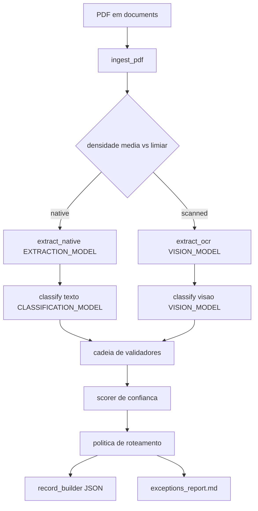

# Fluxo de dados do pipeline

Visao do fluxo de um PDF ate o JSON de saida e o relatorio de excecoes.

## Etapas

| Step | Entrada | Saida |
|------|---------|-------|
| ingest | path PDF | `DocumentState` com texto e/ou `page_images_base64` |
| extract | state + pdf_kind | `CorporateEventRecord` + `FieldEvidence` |
| classify | texto ou imagens | `tipo_evento`, divergencia, raciocinio |
| validate | record | lista de `ValidationResult` |
| score | state | `field_confidences`, `overall_confidence` |
| route | validacao + confianca | `auto_approve` ou `human_review` |
| output | state final | `output/records/*.json` + relatorio |

## Precedencia de roteamento

1. fail golden_records
2. fail date_coherence ou gross_net_consistency
3. campo critico (tipo_evento, valor_bruto, data_com) com confianca low
4. OCR/scanned com overall < 0.85
5. senao auto_approve (warnings no relatorio)

Contrato JSON: [../schemas/output-json-example.md](../schemas/output-json-example.md).
